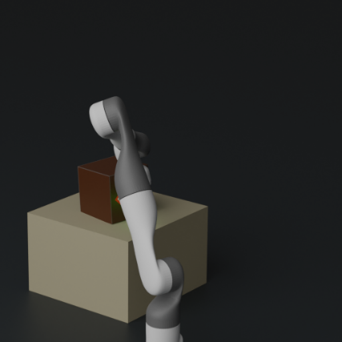
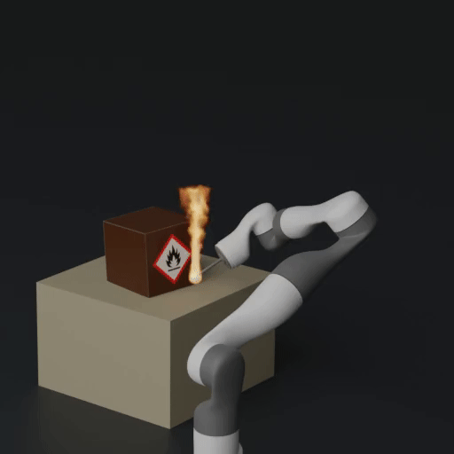
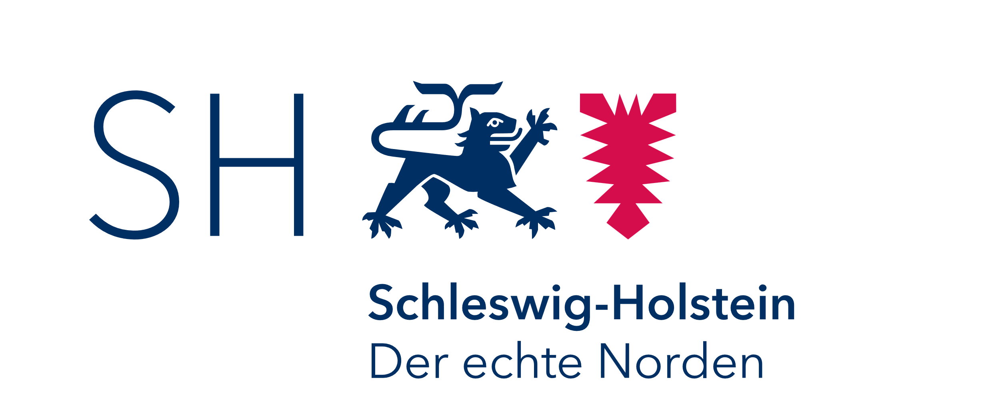
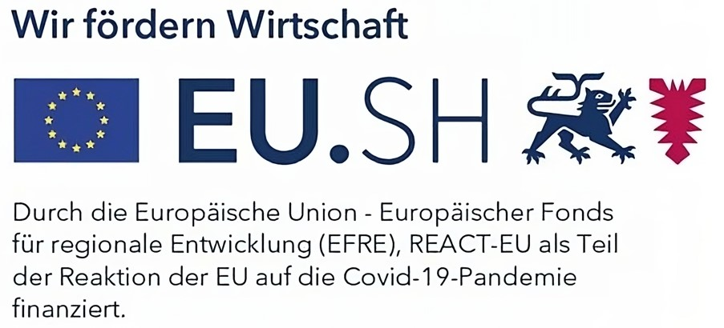

# Learning Occlusions in Robotic Systems: How to Prevent Robots from Hiding Themselves
J. Nazarenus, S. Reichhuber, M. Amersdorfer, L. Elsner, R. Koch, S. Tomforde, H. Abbas

  
  

This repository contains the official authors implementation associated with the paper "Learning Occlusions in Robotic Systems: How to Prevent Robots from Hiding Themselves"

    

# BibTeX
<section class="section" id="BibTeX">
    

    <pre style="border-radius: 10px; overflow: hidden;"><code>@inproceedings{Nazarenus2024Learning,
            author    = {Nazarenus, J. and Reichhuber, S. and Amersdorfer, M. and Elsner, L. and Koch, R. and Tomforde, S. and Abbas, H.},
            title     = {Learning Occlusions in Robotic Systems: How to Prevent Robots from Hiding Themselves},
            booktitle = {Proceedings of the 16th International Conference on Agents and Artificial Intelligence},
            volume    = {2},
            pages     = {482--492},
            year      = {2024},
            isbn      = {978-989-758-680-4},
            issn      = {2184-433X},
            }</code></pre>

</section>

# Funding
This research is funded through the Project "OP der Zukunft" within the funding program by Europäischen Fonds für Regionale Entwicklung (REACT-EU).

# Colab
If you want to quickly run the code, you can use this colab notebook. Esure to select a T4 gpu for the runtime before training for accelerated training.

# Prerequisites
- [Python 3.8 or later](https://www.python.org/downloads/)
- [PyTorch with CUDA support](https://pytorch.org/get-started/locally/)
- [Ray Tune](https://docs.ray.io/en/latest/ray-overview/installation.html)
- [FastAPI](https://fastapi.tiangolo.com/#installation)
- [NumPy](https://numpy.org/install/)
- [SciPy](https://scipy.org/install/)
- [tqdm](https://tqdm.github.io/)

# Usage
For validating the results, the script `validate.py param` offers to execute different experiments such as training on different datasets, measuring inference latencies or performing a hyperparameter search. There are the following parameters available:

param | Explanation
--- | --- 
`baseline` | Trains the MLP on a uniformly distributed synthetic dataset of $10^6$ samples
`synthetic` | Trains the MLP on a synthetic sampling trajectory of $6\mathrm{h}$ and $10^5$ samples
`real` | Trains the MLP on a real-world dataset of $6\mathrm{h}$ and $10^5$ samples
`duration` | Trains the MLP on a series of trajectories with increasing durations
`hyperparameters` | Performs a hyperparameter search
`latency` | Analyses the MLP's latency for inference and gradient computation
`nullspace` | Optimizes a robot configuration in order to improve the visibility

To generate random sampling trajectories use `python trajectory_generation.py`